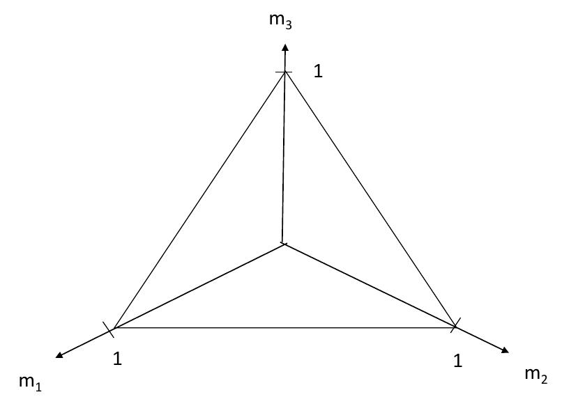

```{r setup, include=FALSE}
knitr::opts_chunk$set(echo = TRUE)

require(xtable)
require(knitr)
require(fBasics)
require(moments)
require(pracma)
require(empiricalGameTheory)
require(deSolve)
var.exists <- function(var) length(grep(var, ls(globalenv()))) > 0
#InitialiseSnowfall(num.cpus=8)
if (file.exists("abm-dynamics.RData")){
  attach("abm-dynamics.RData")
}
require(gtools)

Join <- function(x, y) {
  merge(x, y, all=T)
}

#source('../R/rps_test.R')

```

## Fitness functions

- Fitness is a function of a given phenotype, $i$, *together with its environment*, $\eta$.

$F(i | \eta)$

- For a static environment, we have a static fitness function.

## Fitness landscapes


## Ecology


## Co-evolution 

- In general, the environment consists of other phenotypes, *who are also evolving*.

- Fitness depends on the outcome of *joint interactions* between two or more individuals.

- In this case, each phenotype has its own fitness function, which depends on the other phenotypes.

$F(i | j, k, \ldots )$

- Fitness functions of this form are sometimes called *competitive* fitness functions.

- This results in *co-evolution*.

## Evolutionary Arms-Races

- Co-evolution can give rise to evolutionary "arms races".

- As one species evolves, e.g. superior pursuit skills, the
other species evolves superior evasion skills.  

- This can lead to a feedback loop.


## Hosts and parasites


## Co-evolutionary algorithms

- We can design evolutionary algorithms based on co-evolution, just as we can for static problems.

- Such algorithms are called *co-evolutionary algorithms*.

- Any algorithm in which the fitness of an individual in the population depends on other individuals can be considered co-evolutionary.

- Sometimes the population into a separate sub-populations, which interact.

- Co-evolution can sometimes allow us to escape from local optima.

## Co-evolving sorting networks


Hillis, W. D. (1992). Co-evolving parasites improve simulated evolution as an optimization procedure. Physica D: Nonlinear Phenomena, 42(1–3), 228–234.

## Co-evolving sorting networks

- Two sub-populations:
    - solutions
    - test-cases
- Fitness function for solutions ("hosts"):
    - Percentage of successful test-cases
- Fitness function for test-cases ("parasites"):
    - Number of failures caused in the host.

- Co-evolution between "hosts" and "parasites" results in an "arms-race" that avoids local optima.

## Co-evolutionary "pathologies"

- Mediocre-Stable States
- Cycling
- Disengagement

Ficici, S. G., & Pollack, J. B. (1998). Challenges in Coevolutionary Learning: Arms-Race Dynamics, Open-Endedness, and Mediocre Stable States. In Proceedings of the sixth international conference on Artificial life (pp. 238–247).

## The logic of animal conflict


- In many cases, one animal yields without a fight.

## Common side-blotched lizards


## Mating strategies

- Orange: guard a large numbers of females, steal mates from blues, but vulnerable to yellow.

- Blue: guard a single female, can detect yellow mimics, but vulnerable to orange.

- Yellow: can mimic females to steal mates from orange

- Prevelance of each type cycles repeatedly between generations.

## Modelling co-evolution

- We will look at a simple mathematical model of co-evolution.

- Each individual is genetically hard-coded to a particular behaviour called its *strategy*.

- Animals compete over a resource with fitness value $V$.

- If they fight, the losing animal loses fitness $C$, whereas the winner gains $V$.

- The cost of losing a conflict is less than the value of the resource $V > C > 0$.

## Expected fitness

- Animals interact very many times within each generation.

- *Expected* fitness determines the proportion of behaviours in the subsequent generation.

## Hawks and Doves

- Initially, we have two strategies, labelled $H$ for hawk, and $D$ for dove.
    - Dove: passive
    - Hawk: aggressive

- Hawk competes with Dove:
    - Hawk gains fitness $V$, dove gains $0$.
- Dove competes with Dove:
    - Animals share resource equally ($C/2$).
- Hawk competes with Hawk
    - Fight ensues, equal chance of winning $V$ or losing $-C$.
    
## As a competitive fitness function

$$F(H|D) = V$$

$$F(D|D) = V/2$$

$$F(H|H) = (V-C)/2$$

$$F(D|H) = 0$$

## As a payoff matrix

|          | $H$        | $D$    |
| -------- | ---------- | -------|
| $H$      | $(V-C)/2$  | $V$    |
| $D$      | $0$        | $V/2$  |

## Frequency-dependent fitness

- Now imagine a very large population of animals, each of which is genetically hard-coded to $H$ or $D$.

- Pairs of animals are repeatedly picked at random, and undergo the competition.

- Let $x$ denote the current proportion (*frequency*) of hawks in the population.

\begin{align}
F(H|x) & = & x \times F(H|H) + (1-x) \times F(H|D) \\& = & x(V - C)/2 + (1-x)V
\end{align}

\begin{align}
F(D|x) & = & x \times F(D|H) + (1-x) \times F(D|D) \\& = & (1-x)V/2
\end{align}

## Population dynamics

- Let $F(x)$ denote the average fitness of an individual in the population:

$$F(x) = x \times F(H|x) + (1-x) \times F(D|x)$$

- After reproduction, each type increases proportionate to its relative fitness:

\begin{align}
x' & = & x \frac{F(H|x)}{F(x)} \\
& = & \frac{x}{C x^2 - V} (C x + V x - 2 V)
\end{align}

## Numerical example

```{r}
V = 4
C = 3

x = 0.01

replicate <- function(x) {
  x*(C*x + V*x - 2*V)/(C*x**2 - V)
}

result = c()
period = 0:13
for(t in period) {
  result = c(result, x)
  x = replicate(x)
}
```

## Numerical example - data 

```{r, echo=F, results='asis'}
dataset = data.frame(t = period, x = result)
print(xtable(dataset), type='html')
```

## Numerical example - plot

```{r, echo=F}
plot(period, result, type='l')  
```
   
## Using matrix algebra

$$\mathbf{A} = \begin{bmatrix}(V-C)/2 & V\\ 0 & V/2 \end{bmatrix}$$

With constant payoffs, we can use a quadratic fitness function:

$$F(i, \mathbf{x}) = (\mathbf{A}\mathbf{x})_i$$

$$F(\mathbf{x}) = \mathbf{x}^T \mathbf{A} \mathbf{x}$$

$$x_i' = x_i \frac{F(i, \mathbf{x})}{F(\mathbf{x})}$$

## Payoff to a mixed strategy

- We can also express the expected payoff to a mix of strategies.

- For example, suppose we have two separate populations, with frequencies $\mathbf{x}$ and $\mathbf{y}$,

- what is the expected payoff to an individual chosen at random from one population when played against the other?

 $$F(\mathbf{x}, \mathbf{y}) = \mathbf{x}^T A \mathbf{y}$$

## Evolutionarily Stable Strategies 


## ESS conditions

- Evolutionarily Stable Strategies is often abbreviated ESS.

- Condition:

$$F(\mathbf{x}, (1 - \epsilon) \mathbf{x} + \epsilon \mathbf{y})  > u(\mathbf{y}, \epsilon \mathbf{y} + (1 - \epsilon) \mathbf{y}) \\ \forall \mathbf{y} \neq \mathbf{x}$$

Implies:

$$F(\mathbf{x}, \mathbf{x}) > F(\mathbf{y}, \mathbf{x}) \; \forall \mathbf{y}$$

or

$$F(\mathbf{x}, \mathbf{x}) = F(\mathbf{y}, \mathbf{x}) \wedge F(\mathbf{x}, \mathbf{y}) > F(\mathbf{y}, \mathbf{y}) \; \forall \mathbf{y} \neq \mathbf{x}  $$


## Continuous time

- Let $N_i$ be the *number* of individuals in the population playing strategy $i$.

- Then the rate of change of the population is given by:

$$\frac{dN_i}{dt} = f_i N_i$$
$$x_i = N_i / N$$

$$\frac{dN}{dt} = F(\mathbf{x}) \times N$$

$$\frac{dx_i}{dt} = x_i ( F(i, \mathbf{x}) - F(\mathbf(x)) )$$

## Three strategies

$$A = \begin{bmatrix}0 & -1 & 1\\ 1 & 0 & -1\\ -1 & 1 & 0 \end{bmatrix}$$


## Integrating the replicator equations

```{r}
RPS <- function (time, state, parms) {
  with(as.list(c(state)), {
    dR = R*(S - P)
    dP = P*(R - S)
    dS = S*(P - R)
    return(list(c(dR, dP, dS)))
  })
}

IntegrateRPS  <- function(t, state =  c(R = 0.2, P = 0.2, S = 0.6)) {
  as.data.frame(ode(func = RPS, y = state, times = t))
}  

t <- seq(0, 300, by=0.01)
population.frequencies <- IntegrateRPS(t)[,2:4]
```

## Time series

```{r, echo=FALSE}
x = t[1:2000]
y = population.frequencies[1:2000,]
plot(x, y[,1], type='l', xlab='t', ylab='m')
lines(x, y[,2], col='red')
lines(x, y[,3], col='blue')
```

## Visualising population states


## Visualising population states



## Visualising population states


## RPS phase space 

```{r, echo=FALSE}
# Compute trajectories for all specified initial conditions over the specified time interval
if (!var.exists('game.rps.analysed'))
  #game.rps.analysed <- Analyse(game.rps, initial.values = initial.values.random, times = t, parallel=T)
result <- plot(game.rps.analysed)
```

## RPS in nature


## Co-evolutionary pathologies

- We can now see why we sometimes observe cycling or "mediocre stable states".

- Whether these are pathological depends on the purpose of the algorithm.

- If the co-evolutionary algorithm is designed to approximate evolutionary dynamics or find equilibria,
then these are *solutions*, not pathologies.

## Robust strategies

- Intuitively, we are using co-evolutionary algorithms to find strategies that are *robust*.

- This intuitive concept needs to be specified very carefully.

- We also need to consider the mathematical properties of the competitive fitness function.

- That is, we should think about the underlying evolutionary game.

- If there are multiple equilibria, it may not make sense to look for "robust" strategies.

# Game-theoretic co-evolution

Outside of the scope of the current lecture, but for more reading:

- Noble, J., & Watson, R. A. (2001). Pareto coevolution: Using performance against coevolved opponents in a game as dimensions for Pareto selection (pp. 493–50). 

Ficici, S. G., & Pollack, J. B. (2003). A Game-Theoretic Memory Mechanism for Coevolution. 

Ficici, S. G., Melnik, O., & Pollack, J. B. (2005). A game-theoretic and dynamical-systems analysis of selection methods in coevolution. IEEE Transactions on Evolutionary Computation, 9(6), 580–602. http://doi.org/10.1109/TEVC.2005.856203
 